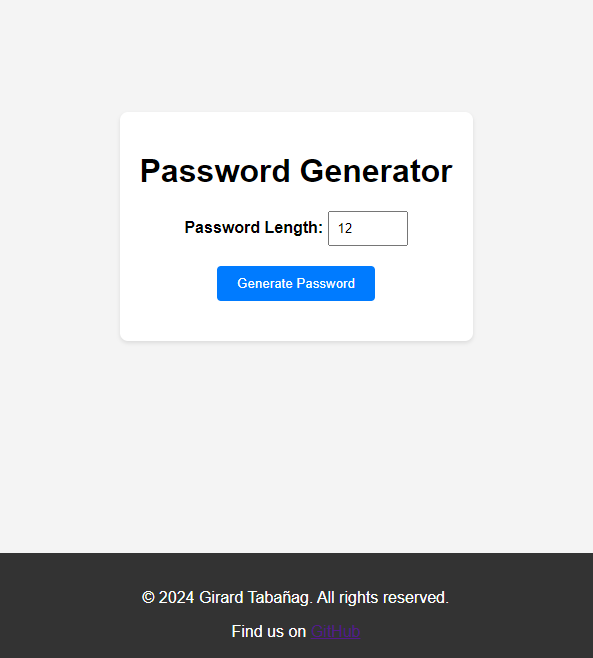

# Password Generator

A simple web-based password generator application built with HTML, CSS, and JavaScript. This application allows users to generate random passwords of custom lengths.

## Why Use a Password Random Generator and Avoid Reusing Passwords?

Using a password random generator and avoiding the use of the same password for different websites is crucial for maintaining strong security practices. Here's why it's important:

- **Protection Against Breaches**: If a website is compromised, using the same password elsewhere puts all your accounts at risk. Unique passwords from a generator limit the damage to just one account.

- **Prevents Credential Stuffing**: Attackers use leaked passwords to access other accounts. Unique passwords make this tactic ineffective.

- **Varied Website Security**: Not all websites store passwords securely. Unique passwords limit exposure if one site's security is compromised.

- **Compliance**: Many regulations require strong security practices, including unique passwords, to protect sensitive data.

In short, unique passwords generated by a password random generator are crucial for robust security and compliance with regulations.

## Features

- Generate random passwords with custom lengths.
- Copy generated passwords to clipboard with a single click.

## Usage

1. Open `index.html` in a web browser.
2. Enter the desired password length in the input field.
3. Click on the "Generate Password" button to generate a random password.
4. Click on the "Copy Password" button to copy the generated password to the clipboard.

## Preview

## Author

[Girard Tabañag](https://password.tabanag.com)

## License

All rights reserved. This project is not open source and may not be copied, distributed, or modified without express permission from the author.